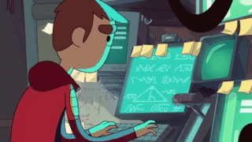

[linkedin-shield]: https://img.shields.io/badge/-LinkedIn-c14438?style=flat-square&logo=linkedin&colorB=2867B2
[linkedin-url]: https://www.linkedin.com/in/thiago-furtado-silva/

[gmail-shield]: https://img.shields.io/badge/-Gmail-c14438?style=flat-square&logo=Gmail&colorB=FD1D1D&logoColor=white
[gmail-url]: mailto:thiagof89.tf@gmail.com

[instagram-shield]: https://img.shields.io/badge/-Instagram-c14438?style=flat-square&logo=Instagram&colorB=833AB4&logoColor=white
[instagram-url]: https://www.instagram.com/thiag0_dev/

[![LinkedIn][linkedin-shield]][linkedin-url]
[![Gmail][gmail-shield]][gmail-url]
[![Instagram][instagram-shield]][instagram-url]

## :smile: About me
Hello, I am a Front End Developer looking for FullStack status.
My focus is the Javascript Stack. :stuck_out_tongue_winking_eye:

## :balloon: Techs

## :cherries: Operational systems

